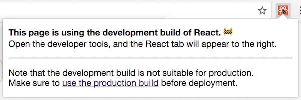

> 原文地址: https://overreacted.io/how-does-the-development-mode-work/
>
> 原文作者:  [Dan Abramov](https://mobile.twitter.com/dan_abramov)
>

<details>
  <summary>如果你的 JavaScript 代码库已经达到的中等复杂度, 你也许可以选择在 development 和 production 打包和运行不同的代码.</summary>

  If your JavaScript codebase is even moderately complex, you probably have a way to bundle and run different code in development and production.
</details>

<details>
  <summary>
    在 development 和 production 打包和运行不同的代码是强大的. 在开发模式下, React 包含很多警告, 来帮助你在引入 bug 之前找到对应的问题. 但是, 探测这些错误的必要的代码经常会增加包体积和使 app 运行比较缓慢.
  </summary>
  Bundling and running different code in development and production is powerful. In development mode, React includes many warnings that help you find problems before they lead to bugs. However, the code necessary to detect such mistakes often increases the bundle size and makes the app run slower.
</details>

<details>
  <summary>
    development 下这个缓慢是可以接受的. 实际上, 在 development 下运行代码比较缓慢也许甚至是有裨益的, 因为其部分补偿了在快速的开发机器和平均水平的消费者机器之间的差异.
  </summary>
  The slowdown is acceptable in development. In fact, running the code slower in development might even be beneficial because it partially compensates for the discrepancy between fast developer machines and an average consumer device.
</details>

<details>
  <summary>
    生产环境下, 我们不想要付出任何的这种消耗. 因此, 在生产环境下我们省略了这些检查. 这是如何工作的? 让我们来看一看.
  </summary>
  In production we don’t want to pay any of that cost. Hence, we omit these checks in production. How does that work? Let’s take a look.
</details>

-------

<details>
  <summary>
    在开发环境运行不同的代码的确切的方式依赖你的 JavaScript 构建流程(以及是否有一个). 在 Facebook 它看起来像这样:
  </summary>
  The exact way to run different code in development depends on your JavaScript build pipeline (and whether you have one). At Facebook it looks like this:
</details>

```js
if (__DEV__) {
  doSomethingDev()
} else {
  doSomethingProd()
}
```

<details open>
  <summary>
    这里, `__DEV__` 并不是一个真正的变量. 这是一个常量, 当 modules 为了浏览器被一起拼接时, 其将会被替换. 结果看起来像这样:
  </summary>
  Here, `__DEV__` isn’t a real variable. It’s a constant that gets substituted when the modules are stitched together for the browser. The result looks like this:
</details>

```js
// in Development:
if (true) {
  doSomethingDev()  // 👈
} else {
  doSomethingProd()
}

// in Production
if (false) {
  doSomethingDev()
} else {
  doSomethingProd() // 👈
}
```

<details>
  <summary>
    在生产环境下, 你还要在代码之上运行一个缩小器(minifier)(比如 terser). 大多数的 JavaScript 缩小器(minifier) 会做一些有限制的 <a href="https://zh.wikipedia.org/wiki/死碼刪除">死码删除</a>, 比如移除 <code>if (false)</code> 分支, 因此在生产环境你将会看到:
  </summary>
  In production, you’d also run a minifier (for example, terser) on the code. Most JavaScript minifiers do a limited form of dead code elimination, such as removing if (false) branches. So in production you’d only see:
</details>

```js
// In production (after minification)
doSomethingProd()
```

<details>
  <summary>
    <em>(注意, 主流的 JavaScript 工具对于有效的死码移除是非常有限的, 不过这是另一个话题了.)</em>
  </summary>
  <em>(Note that there are significant limits on how effective dead code elimination can be with mainstream JavaScript tools, but that’s a separate topic.)</em>
</details>

<details>
  <summary>
    虽然你可能没有使用 `__DEV__` 魔法变量, 如果你使用像 webpack 之类的流行的 JavaScript 打包工具, 这里很可能有一些约定你可以遵循. 例如, 表达相同模式是非常普遍的, 像这样:
  </summary>
  While you might not be using a __DEV__ magic constant, if you use a popular JavaScript bundler like webpack, there’s probably some other convention you can follow. For example, it’s common to express the same pattern like this:
</details>

```js
if (process.env.NODE_ENV === 'production') {
  doSomethingDev()
} else {
  doSomethingProd()
}
```

<details>
  <summary>
    <b>当你使用打包器从 npm import 一些例如 React, Vue 的库的时候, 它们正是使用了这种模式.</b> (单文件 <code>&lt;script&gt;</code> 标签构建为开发环境和生产环境提供了不同的 <code>.js</code> 和 <code>.min.js</code> 文件.)
  </summary>
  <b>That’s exactly the pattern used by libraries like React and Vue when you import them from npm using a bundler.</b> (Single-file <code>&lt;script&gt;</code> tag builds offer development and production versions as separate <code>.js</code> and <code>.min.js</code> files.)
</details>

<details>
  <summary>
    这个特殊的约定最初来源于 Node.js. 在 Node.js 中, 有一个全局的 <code>process</code> 变量, 其暴露系统的的环境变量作为 <code>process.env</code> 对象的属性. 但是, 当你在前端的代码库中看到这个模式, 这里通常没有任何真正的 <code>process</code> 变量介入. 🤯
  </summary>
  This particular convention originally comes from Node.js. In Node.js, there is a global <code>process</code> variable that exposes your system’s environment variables as properties on the <code>process.env</code> object. However, when you see this pattern in a front-end codebase, there isn’t usually any real <code>process</code> variable involved. 🤯
</details>

<details>
  <summary>
    替换的是, 整个 <code>process.env.NODE_ENV</code> 表达式都会在构建时期被替换成一个字符串字面量, 就好像我们的魔法 <code>__ENV__</code> 变量:
  </summary>
  Instead, the whole <code>process.env.NODE_ENV</code> expression gets substituted by a string literal at the build time, just like our magic <code>__ENV__</code> variable:
</details>

```js
// In development:
if ('develpment' !== 'production') {
  doSomethingDev(); // 👈
} else {
  doSomethingProd();
}

// In production:
if ('production' !== 'production') {
  doSomethingDev();
} else {
  doSomethingProd(); // 👈
}
```

<details>
  <summary>
    因为整个表达式是固定的 (<code>'production' !== 'production'</code>保证为 <code>false</code>), 一个压缩器同样可以移除其他的分支.
  </summary>
  Because the whole expression is constant (<code>'production' !== 'production'</code> is guaranteed to be <code>false</code>), a minifier can also remove the other branch.
</details>

```js
// In production(after minification):
doSomethingProd();
```

<details>
  <summary>
    恶作剧完成
  </summary>
  Mischief managed.
</details>

---

<details>
  <summary>
    注意, 更复杂的表达式这将不会工作:
  </summary>
  Note that this wouldn’t work with more complex expressions:
</details>

```js
let mode = 'production';
if (mode !== 'production') {
  // 🔴 not guaranteed to be eliminated
}
```

<details>
  <summary>
    JavaScript 静态分析工具还没有太智能, 因为该门语言的动态天性.当它们看到诸如 <code>mode</code> 这种变量而不是像 <code>false</code> 或者是 <code>'production' !== 'production'</code> 这种表达式的时候, 它们往往会放弃.
  </summary>
  JavaScript static analysis tools are not very smart due to the dynamic nature of the language. When they see variables like <code>mode</code> rather than static expressions like <code>false</code> or <code>'production' !== 'production'</code>, they often give up.
</details>

<details>
  <summary>
    相似的, 当你使用顶级 import 语句的时候, 在穿越模块边界的 JavaScript 之中的死码移除通常也不会工作:
  </summary>
  Similarly, dead code elimination in JavaScript often doesn’t work well across the module boundaries when you use the top-level import statements:
</details>

```js
import {someFunc} from 'some-module';

if (false) {
  someFunc()
}
```

<details>
  <summary>
    因此你需要以非常机械的方式写书写代码, 使得条件绝对静态, 并且确保你想要移除的所有代码都在其中.
  </summary>
  So you need to write code in a very mechanical way that makes the condition definitely static, and ensure that all code you want to eliminate is inside of it.
</details>

<details>
  <summary>
    为了让这些工作, 你的打包器需要去做 <code>process.env.NODE</code> 的替换, 并且需要知道你想打包该项目的哪一种模式.
  </summary>
  For all of this to work, your bundler needs to do the process.env.NODE_ENV replacement, and needs to know in which mode you want to build the project in.
</details>

<details>
  <summary>
    几年以前, 忘了配置环境是过去常常看到的. 你会经常看到一个项目在开发环境下部署到了生产环境.
  </summary>
  A few years ago, it used to be common to forget to configure the environment. You’d often see a project in development mode deployed to production.
</details>

<details>
  <summary>
    这很沮丧, 因为它使得网站加载和运行比较慢.
  </summary>
  That’s bad because it makes the website load and run slower.
</details>

<details>
  <summary>
    在最近的两年, 这个情况已经很大的改善. 例如, webpack 增加了一个简单的 <code>mode</code> 选项来替代手动的配置 <code>process.env.NODE_ENV</code> 的替换. 当站点在开发模式下的时候, React Devtools 现在也展示一个红色的 icon, 使其容易发现和甚至是<a href="https://mobile.twitter.com/BestBuySupport/status/1027195363713736704">报告</a>.
  </summary>
  In the last two years, the situation has significantly improved. For example, webpack added a simple <code>mode</code> option instead of manually configuring the <code>process.env.NODE_ENV</code> replacement. React DevTools also now displays a red icon on sites with development mode, making it easy to spot and even <a href="https://mobile.twitter.com/BestBuySupport/status/1027195363713736704">report</a>.
</details>



<details>
  <summary>
    像 Create React App, Next/Nuxt, Vue CLI, Gatsby 这样的观点鲜明的设置工具通过分开开发打包和生产打包成为两个单独的命令使其更难去弄乱.(例如, <code>npm start</code> 和 <code>npm run build</code>) 特别的是, 只有生产打包可以部署, 所以开发者再也不会犯这种错误了.
  </summary>
  Opinionated setups like Create React App, Next/Nuxt, Vue CLI, Gatsby, and others make it even harder to mess up by separating the development builds and production builds into two separate commands. (For example, <code>npm start</code> and <code>npm run build</code>.) Typically, only a production build can be deployed, so the developer can’t make this mistake anymore.
</details>

<details>
  <summary>
    这里经常有一个观点, 也许生产模式需要成为默认, 开发模式需要选择性加入. 就个人而言, 我没有发现这个观点是有说服力的. 从开发模式的警告中获益很多的人一般是刚刚接触库. 他们大概是不知道如何开启的, 并且常常会忽略一些可以在早期就被感知到的一些 bug.
  </summary>
  There is always an argument that maybe the production mode needs to be the default, and the development mode needs to be opt-in. Personally, I don’t find this argument convincing. People who benefit most from the development mode warnings are often new to the library. They wouldn’t know to turn it on, and would miss the many bugs that the warnings would have detected early.
</details>

<details>
  <summary>
    是的, 性能问题是不好的. 但是, 想终端终于提供破损的, 古怪的体验也是如此. 例如, <a href="https://reactjs.org/docs/lists-and-keys.html#keys">React key warning</a> 帮助避免如发送一个消息给错误的人或买了一个错误的产品这类 bug. 开发过程中关掉该警告, 对你和你的用户都会陷入重大的风险中.如果这个默认是关掉的, 随后你发现了开关并且将其打开, 你将拥有太多的警告需要去清理. 因此大部分的人将关掉开关. 这就是为什么其需要从开始就是开启的, 而不是在之后再开启.
  </summary>
  Yes, performance issues are bad. But so is shipping broken buggy experiences to the end users. For example, the<a href="https://reactjs.org/docs/lists-and-keys.html#keys"> React key warnin</a>g helps prevent bugs like sending a message to a wrong person or buying a wrong product. Developing with this warning disabled is a significant risk for you and your users. If it’s off by default, then by the time you find the toggle and turn it on, you’ll have too many warnings to clean up. So most people would toggle it back off. This is why it needs to be on from the start, rather than enabled later.
</details>

<details>
  <summary>
    最后, 即使开发警告是可选的, 并且开发者知道如何在早起的开发中开启它们, 我们将回到最初的问题, 一些人将会意外的在部署生产的时候保持它们是开启的!
  </summary>
  Finally, even if development warnings were opt-in, and developers knew to turn them on early in development, we’d just go back to the original problem. Someone would accidentally leave them on when deploying to production!
</details>

<details>
  <summary>我们又回到了原点.</summary>
  And we’re back to square one.
</details>
